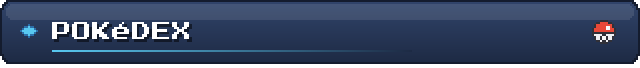
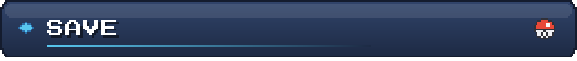

  

&nbsp;

 
&nbsp;

  

*You Lost!*

&nbsp;

`COLE saved the game!`

Built with a custom pixel-art SVG generator (<a href="scripts/build_assets.py">scripts/build_assets.py</a>). Font: Press Start 2P (OFL). Sprites via PokeAPI &amp; Pokémon Showdown — Pokémon © Nintendo/Game Freak.

